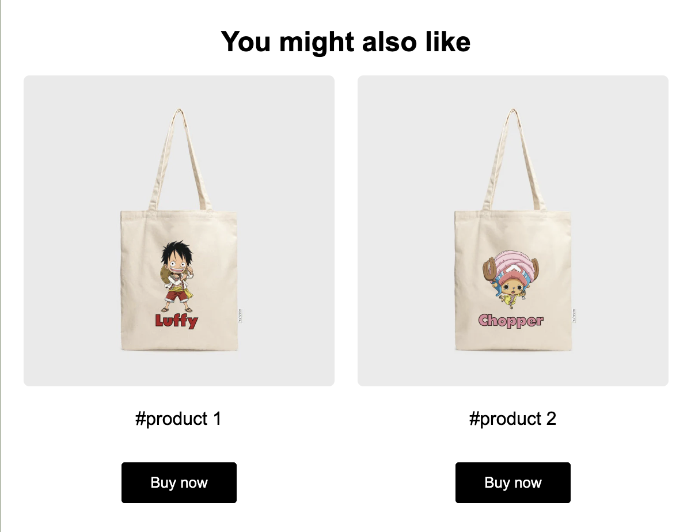

# Smart MJML

Smart MJML is a library that provides TypeScript intelligence hints and checks, making editing MJML simpler.


## Features

- **Syntax Consistency**: Smart MJML offers an almost consistent coding style with MJML. You can write your code just like you're writing MJML, while enjoying the intelligence hints and compile-time checks provided by TypeScript.

- **Platform Compatibility**: Smart MJML can run on both the browser and Node.js. No matter which platform you're developing on, Smart MJML can provide you with a consistent experience.

- **Template Engine Compatibility**: You can easily integrate Smart MJML with other template engines, without worrying about layout confusion.

- **Framework Support**: Smart MJML already supports React and Vue, and in theory, it can be easily integrated with other JSX frameworks.

## Live Demo

[small-mjml-react-demo](https://codesandbox.io/p/github/Easy-Email-Pro/small-mjml-react-demo/preview)

Open CodeSandbox, edit template.tsx, and you will see TypeScript hints.

## Installation

```bash
npm install smart-mjml
```

Usage:

```tsx
import mjml2html from "mjml-browser";
// When using vue, use vueJsxToString
import { reactJsxToString } from "smart-mjml";

const mjmlString = reactJsxToString(
  <mjml>
    <mj-head>
      <mj-style inline="inline">
        {`.hide-desktop-block,.hide-desktop-inline-block,.hide-block{display:none!important;mso-hide:all!important}`}
      </mj-style>
      <mj-style>
        {`.mjbody a{color:inherit}.overflow-hidden{overflow:hidden}@media (max-width: 480px){.hide-mobile-block{max-height:0px;overflow:hidden;display:none!important}.hide-desktop-block{display:block!important}.hide-mobile-inline-block{max-height:0px;overflow:hidden;display:none!important}.hide-desktop-inline-block{display:inline-block!important}}`}
      </mj-style>
      <mj-style>
        {`.mjbody a, .mjbody a:hover, .mjbody a:active, .mjbody a[href], .mjbody a[href]:hover, .mjbody a[href]:active {color: inherit;text-decoration: underline}`}
      </mj-style>
      <mj-breakpoint width="480px"></mj-breakpoint>
    </mj-head>
    <mj-body width="600px" background-color="#8C9A80" css-class="mjbody">
      <mj-section padding-bottom="0px" background-color="#263D29">
        <mj-column width="100%">
          <mj-text
            align="center"
            color="#FFFFFF"
            font-family="Arial, sans-serif"
            font-size="16px"
            line-height="130%"
            padding-top="3px"
            padding-bottom="3px"
            font-weight="normal"
          >
            JOIN US FOR A FEAST ON
          </mj-text>
        </mj-column>
      </mj-section>
      <mj-section
        padding-top="0px"
        padding-bottom="0px"
        background-color="#263D29"
      >
        <mj-column width="100%">
          <mj-image
            padding="0px 0px 0px 0px"
            padding-top="0px"
            padding-right="0px"
            padding-bottom="0px"
            padding-left="0px"
            src="http://res.cloudinary.com/djnkpbshx/image/upload/v1706006437/easy-email-pro-test/u7tvjqdbjtxqkykaazra.jpg"
          ></mj-image>
        </mj-column>
      </mj-section>
    </mj-body>
  </mjml>
);
const data = mjml2html(mjmlString);

function App() {
  return (
    <div style={{ display: "flex", height: "100vh" }}>
      <div
        style={{
          width: "50%",
          whiteSpace: "pre",
          backgroundColor: "#1f2227",
          color: "#ffffff",
          height: "100%",
          overflow: "auto",
        }}
      >
        {mjmlString}
      </div>
      <iframe
        style={{ width: "50%", minWidth: 600, height: "100%" }}
        frameBorder={"none"}
        srcDoc={data.html}
      />
      <style>{`body {margin:0}`}</style>
    </div>
  );
}
```

## Note

Due to the syntax restrictions of JSX, comments cannot be used directly and need to be wrapped as a string.
For example, `<!-- Your comment here -->` needs to be written as `{ '<!-- Your comment here -->' }`.
and `<mj-style>.css{color: red;}</mj-style>` needs to be written as `<mj-style>{ '.css{color: red;}' }</mj-style>`.

## Advanced Usage

Let's first talk about the common way of integrating with template engines. Here, we take liquidjs as an example.

```tsx
...
<mj-wrapper background-color="#ffffff" padding-right="10px" padding-left="10px">
  <mj-section background-color="#FFFFFF" padding="0px">
    <mj-column padding="0px" border="none">
      <mj-text
        align="center"
        font-family="Arial, sans-serif"
        font-size="24px"
        line-height="130%"
        font-weight="600"
        padding-top="3px"
        padding-bottom="3px"
      >
        You might also like
      </mj-text>
    </mj-column>
  </mj-section>
  <mj-section background-color="#FFFFFF" padding="0px">
    <mj-group>
      <mj-raw>
        {`<!-- htmlmin:ignore --><!-- htmlmin:ignore -->`}
      </mj-raw>
      <mj-column width="50%">
        <mj-image
          border-radius="5px"
          padding="10px"
          src="{{item.image}}"
        ></mj-image>
        <mj-text
          align="center"
          font-family="Arial, sans-serif"
          font-size="16px"
          padding="10px 0px 0px 0px"
        >{`{{item.title}}`}</mj-text>
        <mj-text
          align="center"
          font-family="Arial, sans-serif"
          padding="10px 0px 0px 0px"
        >{`{{item.price}}`}</mj-text>
        <mj-text
          align="center"
          color="#737373"
          font-family="Arial, sans-serif"
          text-decoration="line-through"
          padding="10px 0px 0px 0px"
        >{`{{item.comparePrice}}`}</mj-text>
        <mj-button
          background-color="#000000"
          font-family="Arial, sans-serif"
          href="#"
        >
          Buy now
        </mj-button>
      </mj-column>
      <mj-raw>
        {`<!-- htmlmin:ignore --><!-- htmlmin:ignore -->`}
      </mj-raw>
    </mj-group>
  </mj-section>
</mj-wrapper>
...
```

```tsx
import { Liquid } from "liquidjs";
const engine = new Liquid();

...
<iframe
  style={{ width: "50%", minWidth: 600, height: "100%", border: "none" }}
  srcDoc={engine.parseAndRenderSync(data.html, dynamicData)}
/>
...
```

It usually looks like this:


It works, but it's still not pretty. We can directly define a custom helper to solve this problem.

1. Define the interface, create a new jsx.d.ts

```tsx
declare namespace JSX {
  interface IntrinsicElements {
    "mj-for": {
      item: string;
      list: string;
      children: any;
    };
  }
}
```

2. Define the helper

```tsx
const helper = (
  type: string,
  attributes: Record<string, string>,
  children: string
): string | null => {
  if (type === "mj-for") {
    const itemName = attributes.item;
    const listName = attributes.list;
    return `
    <mj-raw>
      <!-- htmlmin:ignore --><!-- htmlmin:ignore -->
    </mj-raw>
        ${children}
    <mj-raw>
      <!-- htmlmin:ignore --><!-- htmlmin:ignore -->
    </mj-raw>
    `;
  }
  return null;
};
```

That's it, we can now use it.

```tsx
<mj-wrapper background-color="#ffffff" padding-right="10px" padding-left="10px">
  <mj-section background-color="#FFFFFF" padding="0px">
    <mj-column padding="0px" border="none">
      <mj-text
        align="center"
        font-family="Arial, sans-serif"
        font-size="24px"
        line-height="130%"
        font-weight="600"
        padding-top="3px"
        padding-bottom="3px"
      >
        You might also like
      </mj-text>
    </mj-column>
  </mj-section>
  <mj-section background-color="#FFFFFF" padding="0px">
    <mj-group>
      <mj-for item="item" list="products">
        <mj-column width="50%">
          <mj-image
            border-radius="5px"
            padding="10px"
            src="{{item.image}}"
          ></mj-image>
          <mj-text
            align="center"
            font-family="Arial, sans-serif"
            font-size="16px"
            padding="10px 0px 0px 0px"
          >{`{{item.title}}`}</mj-text>
          <mj-text
            align="center"
            font-family="Arial, sans-serif"
            padding="10px 0px 0px 0px"
          >{`{{item.price}}`}</mj-text>
          <mj-text
            align="center"
            color="#737373"
            font-family="Arial, sans-serif"
            text-decoration="line-through"
            padding="10px 0px 0px 0px"
          >{`{{item.comparePrice}}`}</mj-text>
          <mj-button
            background-color="#000000"
            font-family="Arial, sans-serif"
            href="#"
          >
            Buy now
          </mj-button>
        </mj-column>
      </mj-for>
    </mj-group>
  </mj-section>
</mj-wrapper>
```

## Development

```bash

npm run dev

```
